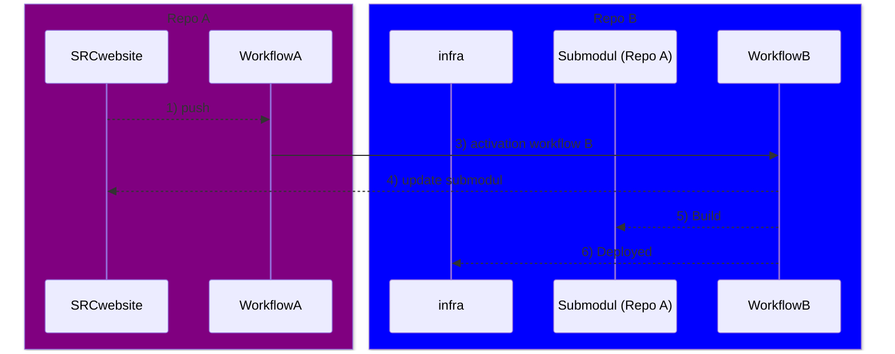
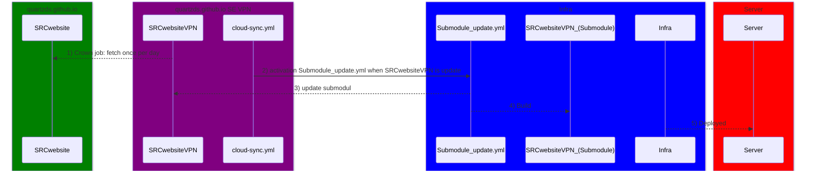

# Gestion des Sous-modules et Workflows CI/CD

## Introduction

Git propose une fonctionnalité appelée **sous-modules** qui permet d'inclure un dépôt Git dans un autre en tant que dépendance. Cela est particulièrement utile lorsque vous souhaitez réutiliser du code partagé (notre cas) ou des bibliothèques (possiblement interessant pour d'autre projet) dans plusieurs projets tout en maintenant ces éléments de façon indépendante.

### Comment ajouter un sous-module

Pour ajouter un sous-module dans votre projet, vous pouvez utiliser la commande suivante :

```bash
git submodule add https://github.com/Name/Repo.git apps/web
```

Dans cet exemple :
- `https://github.com/Name/Repo.git` est l'URL du dépôt du sous-module.
- `apps/web` est le chemin où le sous-module sera ajouté dans le projet parent.

### Explication du fonctionnement des sous-modules

Un sous-module est essentiellement un lien vers un commit spécifique d'un autre dépôt. Vous pouvez penser à un sous-module comme un **snapshot** d'un autre dépôt à un instant donné. Les sous-modules ne suivent pas automatiquement les mises à jour du dépôt parent, vous devez manuellement :

- Mettre à jour les sous-modules pour suivre les nouveaux commits du projet source.
- Valider ces mises à jour dans le projet parent.

### Commandes utiles avec les sous-modules

1. **Mettre à jour le sous-module avec les dernières modifications** :
   ```bash
   git submodule update --remote
   ```
   Cette commande synchronise le sous-module avec la dernière version du dépôt référencé.

2. **Initialiser et cloner un projet contenant des sous-modules** : 
   Après avoir cloné un projet qui contient des sous-modules, vous devez exécuter cette commande pour initialiser les sous-modules :
   ```bash
   git submodule update --init --recursive
   ```

## Automation avec des workflows

Les workflows CI/CD sont mis en place pour automatiser la gestion des sous-modules et leur déploiement. Voici un aperçu du processus via deux workflows GitHub Actions :

### Workflow A
- Déclenché lors d'un **push** dans Repo A (le sous-module).
- Met à jour automatiquement Repo B, qui contient Repo A en tant que sous-module.

### Workflow B
- Déclenché automatiquement après la mise à jour de Repo A.
- Synchronise Repo B avec les dernières modifications du sous-module.
- Déploie le projet avec la nouvelle version du sous-module.

### Visualisation du processus avec Mermaid

Voici une représentation séquentielle des interactions entre les deux workflows et les différents dépôts :



### Explication du diagramme :

1. **`SRCwebsite` (Repo A) effectue un push** : Lorsqu'une modification est faite sur Repo A (le sous-module), cela déclenche le `Workflow A`.
   
2. **`Workflow A` met à jour Repo B** : Après un push sur Repo A, `Workflow A` s'assure que les modifications sont envoyées à Repo B.

3. **`Workflow B` est activé** : Dès que `Workflow A` met à jour Repo B, `Workflow B` est déclenché automatiquement.

4. **Mise à jour du sous-module** : `Workflow B` met à jour le sous-module dans Repo B.

5. **Compilation et déploiement** : Le projet dans Repo B, contenant le sous-module mis à jour, est ensuite compilé (Build) et déployé (Deployed) dans l'infrastructure cible.

---

## Conclusion

Avec ces workflows automatisés, la gestion des sous-modules devient simple et efficace. Chaque modification dans le sous-module déclenche automatiquement une mise à jour et un déploiement dans le projet parent, tout en isolant chaque contributeur dans sa propre branche. Cela garantit un processus sécurisé et évite les risques de briser le projet principal.

---

## Commandes supression sous-module

```bash
$ git submodule deinit RepoA
$ git rm RepoA
$ git commit -m "Removed RepoA module"
$ git push

```


# Documentation intéressante

## Submodule

https://git-scm.com/book/en/v2/Git-Tools-Submodules

https://www.youtube.com/watch?v=PKts7yCmlWk

## Workflows

https://docs.github.com/fr/actions/writing-workflows/workflow-syntax-for-github-actions

https://docs.github.com/fr/actions/writing-workflows/choosing-what-your-workflow-does/running-variations-of-jobs-in-a-workflow

https://www.youtube.com/watch?v=fvqqTI3WscI

https://www.youtube.com/watch?v=mFFXuXjVgkU



