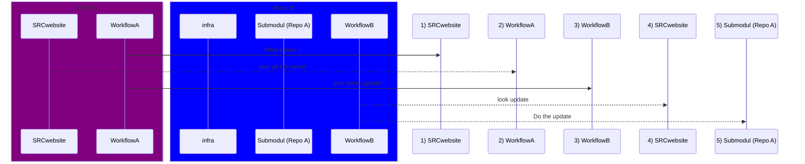

workflow explication :

```mermaid

    sequenceDiagram
    box Purple Repo A
    participant SRCwebsite
    participant WorkflowA
    end
    box blue Repo B
    participant infra
    participant Submodul (Repo A)
    participant  WorkflowB
    end
     WorkflowA->> 1)  SRCwebsite: What's new ?
    SRCwebsite-->> 2) WorkflowA: give all the news!
     WorkflowA->> 3) WorkflowB: give some update!
     WorkflowB-->> 4) SRCwebsite: look update 
     WorkflowB-->>5) Submodul (Repo A): Do the update
```
