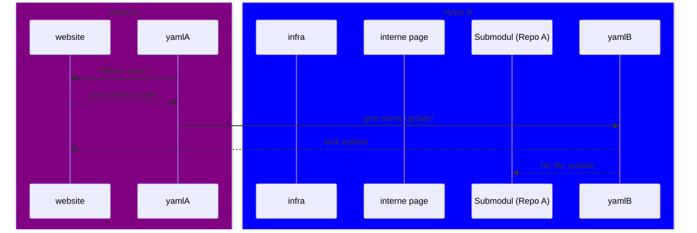

workflow explication :

```mermaid

    sequenceDiagram
    box Purple Repo A
    participant website
    participant yamlA
    end
    box blue Repo B
    participant infra
    participant interne page 
    participant Submodul (Repo A)
    participant yamlB
    end
    yamlA->>website: What's new ?
    website-->>yamlA: give all the news!
    yamlA->>yamlB: give some update!
    yamlB-->> website: look update 
    yamlB-->>Submodul (Repo A): Do the update
```
