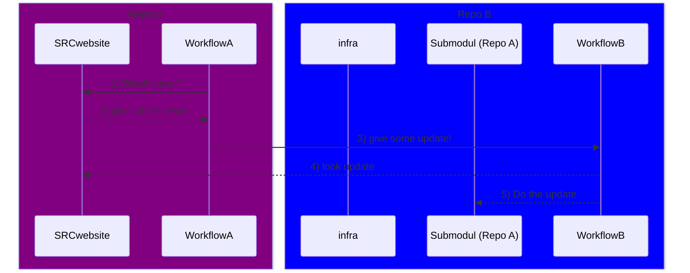

workflow explication :

```mermaid

    sequenceDiagram
    box Purple Repo A
    participant SRCwebsite
    participant WorkflowA
    end
    box blue Repo B
    participant infra
    participant Submodul (Repo A)
    participant  WorkflowB
    end
     WorkflowA->>   SRCwebsite: 1) What's new ?
    SRCwebsite-->>  WorkflowA: 2) give all the news!
     WorkflowA->>  WorkflowB: 3) give some update!
     WorkflowB-->>  SRCwebsite: 4) look update 
     WorkflowB-->>Submodul (Repo A): 5)  Do the update
```
